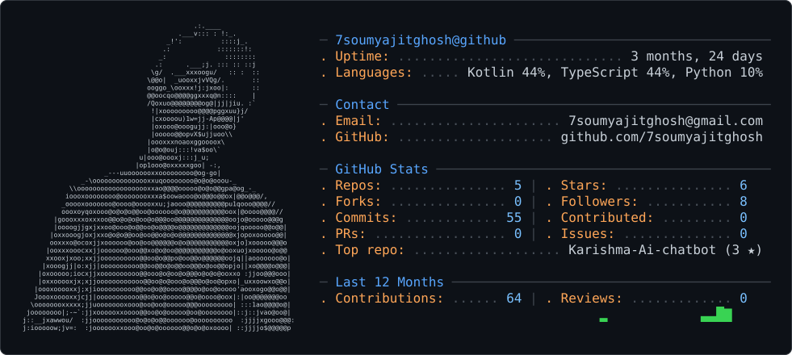

  

<h1 align="center">Soumyajit Ghosh</h1>

  <b>Developer • Builder • AI Enthusiast</b>

  

---

## About

I'm a passionate developer and builder who enjoys creating applications, experimenting with AI, and turning ideas into working products.

---

## ⚡ Tech Stack

  

  
  
  
  

  
  
  

---

## 🚀 Featured Project

  

  AI-powered virtual assistant with conversational AI,
  voice interaction and a modern interactive interface.

---

## 🐙 GitHub

  

  <b>Building • Learning • Experimenting</b>

---

  <b>⚡ Build. Break. Learn. Repeat.</b>

---

## 🐍 Contribution Activity

  <picture>
    <source
      media="(prefers-color-scheme: dark)"
      srcset="https://raw.githubusercontent.com/7soumyajitghosh/7soumyajitghosh/output/github-contribution-grid-snake-dark.svg"
    />
    <source
      media="(prefers-color-scheme: light)"
      srcset="https://raw.githubusercontent.com/7soumyajitghosh/7soumyajitghosh/output/github-contribution-grid-snake.svg"
    />
    
  </picture>

---

  <b>🚀 Keep Building.</b>

